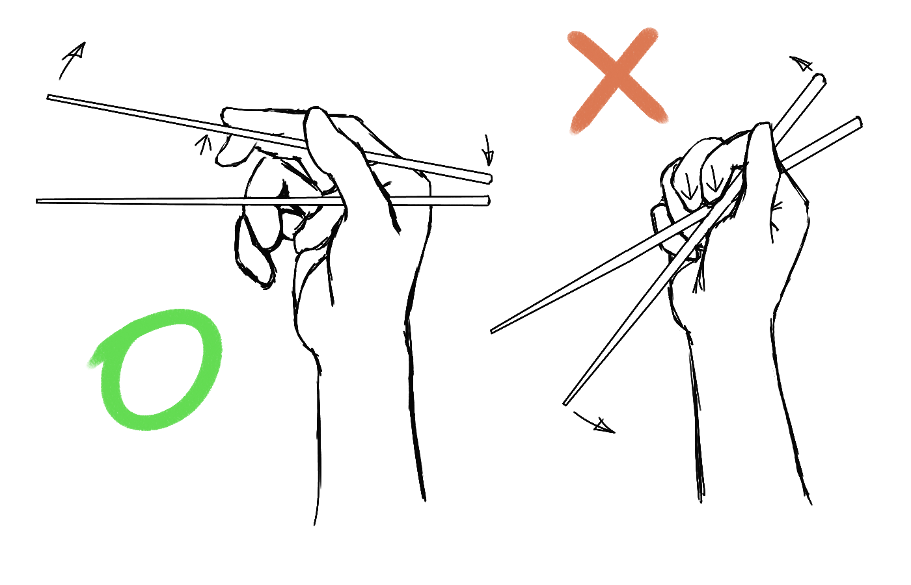

slidenumbers: true

#  Docker for Developers

## Containerization is the new virtualization


James Turnbull
@kartar

---

# who


 - VP of Engineering at Kickstarter
 - Advisor at Docker
 - Open source chap
 - Funny accent

---

# The Docker Book


 [www.dockerbook.com](http://www.dockerbook.com)

---

# Who are you folks?


---

# What's this all about?


---

# What is Docker?


---

# Container virtualization


---

# Build, ship, run


---

# Build once


---

# Run in many places


---

# Isolated
# Layered
# Standard
# Content agnostic


---

# So why should I care?

## Software delivery mechanism
## Portability
## A bit like a VM but ...


---


# ... not like a VM

1. Containers boot faster
2. Containers have less overhead
3. Containers bring native performance
4. Containers are Cloud & VM-compatible

---


# Devs care about their app<br /><br />
# Ops cares about the containers

---


## Why developers care...

- Clean, safe, hygienic and portable
- No worries about dependencies
- Encourage good architecture

---


## Why operations care...

- Make the lifecycle more efficient
- Eliminate inconsistencies
- Support segregation of duties

---



## What can I use Docker for?

- Docker for CI/CD
- Packaging and deploying applications
- Build your own PAAS
- Deploy applications at hyperscale!

---

## Technology Stack

- Runs on most Linux distributions
- Boot2Docker for OSX and Windows
- **Windows in the works!**
- Uses Linux kernel features


---

# Docker Basics

## Image & Dockerfile
## Container
## The Docker Hub


---

# Building Docker images

```go
			FROM       ubuntu
			MAINTAINER James Turnbull "james@example.com"

			RUN apt-get -qqy update
			RUN apt-get install -qqy apache2
			ADD index.html /var/www/

			ENV APACHE_RUN_USER www-data
			ENV APACHE_RUN_GROUP www-data
			ENV APACHE_LOG_DIR /var/log/apache2

			VOLUME [ "/var/log/apache2" ]
			EXPOSE 80

			ENTRYPOINT ["/usr/sbin/apache2"]
			CMD ["-D", "FOREGROUND"]
```

---

# Building the image

```bash
$ sudo docker build -t="jamtur01/fluentconf" .
```

---

# Sharing the image

```bash
$ sudo docker push jamtur01/fluentconf
```

---

# Running the container

```bash
$ sudo docker run --name mywebsite -ti -p 80:80 jamtur01/fluentconf
```

---


# Docker Hub

- Like GitHub but for containers.
- Integrates with GitHub and BitBucket.
- Web hooks for integration with other services.

---


# Workflow

- Write awesome code!
- Commit code.
- (Automatically) build Docker images
- Share images
- Profit!

---


# But it's not simple to build a stack

---


# Docker Compose

- Fast, isolated development environments using Docker.
- Quick and easy to start.
- Manages a collection of containers.

---

# Installing Compose

```bash
$ sudo pip install -U docker-compose
$ docker-compose --version
```

---


# Compose basics

- Build your apps with `Dockerfile`'s.
- Combine applications and images with a `docker-compose.yml` file.

---

# The Dockerfile

```json
FROM ubuntu:14.04
RUN apt-get -yqq update
RUN apt-get -yqq install nodejs npm
RUN ln -s /usr/bin/nodejs /usr/bin/node
RUN mkdir -p /var/log/nodeapp
ADD nodeapp /opt/nodeapp/
WORKDIR /opt/nodeapp
RUN npm install
```

---

# The docker-compose.yml file

```json
db:
  image: redis
  ports:
    - "6379"
web:
  image: jamtur01/fluentdemo
  command: nodejs server.js
  ports:
    - "3000:3000"
  links:
    - db
```

---

# Compose details

- Can build images, use existing or pull images
- Can map ports, manage links and create volumes
- Still single host centric.

---

# Start Compose

```bash
$ sudo docker-compose up
Creating compose_db_1...
Creating compose_web_1...
. . .
```

---


# Demo

---


# Compose benefits

- Build complex local stacks.
- Consistent and shareable.
- No more..

---


---


# Team and Deployment Workflow

- Write awesome code!
- Commit code.
- (Automatically) build Docker images.
- (Automatically) run Jenkins tests.
- Promote images to new environments.
- Profit!

---

# Questions?


