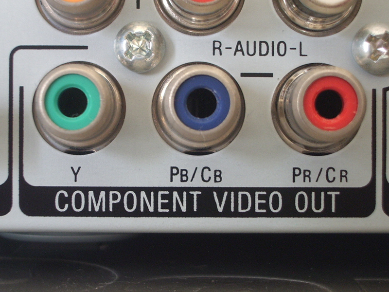
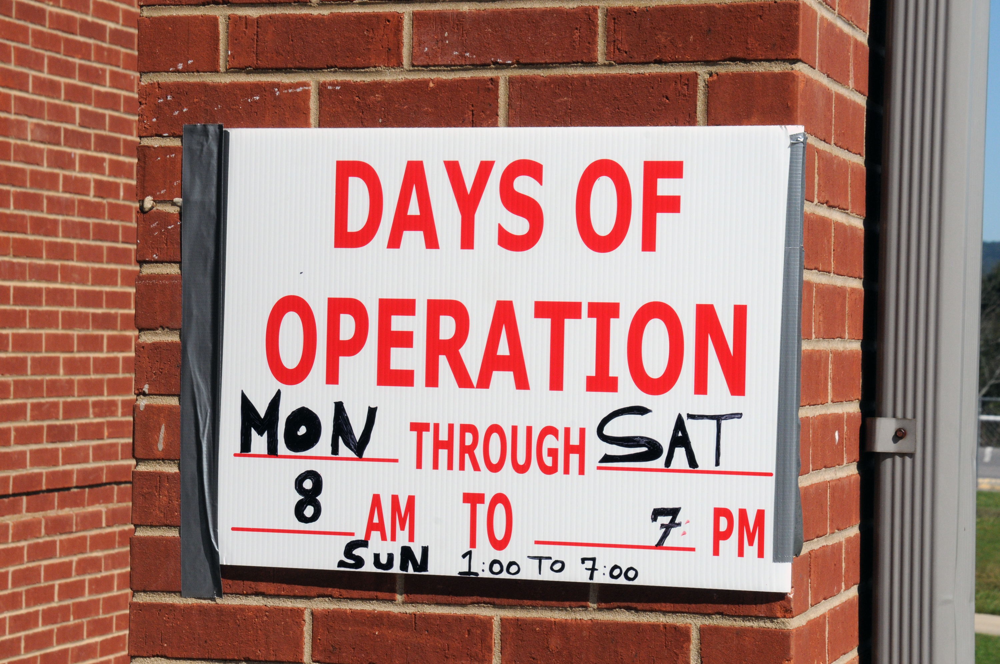

slidenumbers: true

# Introduction to Docker

## Containerization is the new virtualization


James Turnbull
@kartar

---

# who


 - VP of Engineering at Kickstarter
 - Advisor at Docker
 - Open source chap
 - Funny accent

---

# Kickstarter live in Sweden


---

# The Docker Book


 [www.dockerbook.com](http://www.dockerbook.com)

---

# Who are you folks?


---

# What's this all about?


---

# What is Docker?


---

# Container virtualization


---

# Build, ship, run


---

# Build once


---

# Run in many places


---

# Isolated
# Layered
# Standard
# Content agnostic


---

# But this isn't new?!?


---

# So why should I care?

## Software delivery mechanism
## Portability
## A bit like a VM but ...


---

# ... not like a VM

1. Containers boot faster
2. Containers have less overhead
3. Containers bring native performance
4. Containers are Cloud & VM-compatible


---

# Devs care about their app<br /><br />
# Ops cares about the containers


---

## Why developers care...

- Clean, safe, hygienic and portable
- No worries about dependencies
- Encourage good architecture


---

## Why operations care...

- Make the lifecycle more efficient
- Eliminate inconsistencies
- Support segregation of duties


---

## What can I use Docker for?

- Docker for CI/CD
- Packaging and deploying applications
- Build your own PAAS
- Deploy applications at hyperscale!


---

## Does this work with Puppet or Chef?

- Chef and Puppet are state management tools
- Less complex
- Docker images are version controlled and layered
- Smaller, self-contained and lightweight


---

## Technology Stack

- Runs on most Linux distros
- Boot2Docker for OSX and Windows
- **Windows in the works!**
- Uses Linux kernel features


---

# Docker Basics

## Image & Dockerfile
## The Docker Hub
## Container


---

# Building Docker images

```go
			FROM       ubuntu
			MAINTAINER James Turnbull "james@example.com"

			RUN apt-get -qqy update
			RUN apt-get install -qqy apache2
			ADD index.html /var/www/

			ENV APACHE_RUN_USER www-data
			ENV APACHE_RUN_GROUP www-data
			ENV APACHE_LOG_DIR /var/log/apache2

			VOLUME [ "/var/log/apache2" ]
			EXPOSE 80

			ENTRYPOINT ["/usr/sbin/apache2"]
			CMD ["-D", "FOREGROUND"]
```

---

# Building the image

```bash
$ sudo docker build -t="jamtur01/0redev" .
```

---

# Sharing the image

```bash
$ sudo docker push jamtur01/0redev
```

---

# Running the container

```bash
$ sudo docker run --name mywebsite -ti -p 80:80 jamtur01/0redev
```

---

# But there's more!


---

# What if we could componentize . . .



---

# SSH


---

# Managing a container

```bash
$ sudo docker exec -ti mywebsite /bin/bash
```

---

# Scheduling and jobs



---

# Logging


---

# Logging container

```bash
$ sudo docker run --volumes-from mywebsite -ti ubuntu /bin/bash
```

---

# Creates a new architecture


---

# A new architecture that ...

- Separates orthogonal concerns
- Don't rebuild your app to change services
- Have different policies in domains
- Ship lighter apps


---

# Questions?


